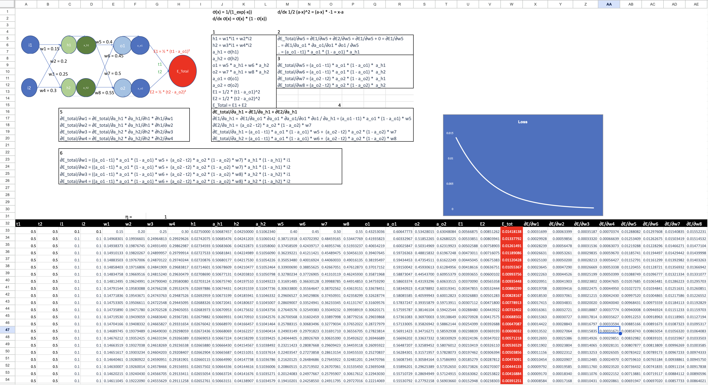

# Part 1

[Click here to download excel sheet](./ERA%20V1%20S6%20Assignment%20P1.xlsx)

Backpropagation is a widely used algorithm for training neural networks. It involves two main steps: forward propagation and backward propagation. Let's go through each step:

## 1. Forward Propagation:
- We start by feeding an input through the network. In this case, we have an input layer of size 2, so we provide a vector with two input values.
- Each neuron in the hidden layer takes the weighted sum of its inputs, applies the sigmoid activation function to the sum, and passes the result to the neurons in the output layer.
- Similarly, each neuron in the output layer takes the weighted sum of its inputs (outputs from the hidden layer), applies the sigmoid activation function, and produces the final output values.

## 2. Backward Propagation:
- After forward propagation, we compare the network's output to the desired output using the mean squared error loss function.
- We then calculate the gradients of the loss function with respect to the weights and biases of the network.
- Starting from the output layer, we propagate these gradients backward through the network, updating the weights and biases using a technique called gradient descent.
- The update for each weight and bias is determined by the gradient and a learning rate, which controls the magnitude of the update.
- The process of updating the weights and biases based on the gradients is repeated iteratively for a number of epochs or until the network converges to a satisfactory solution.
- The steps of backpropagation involve calculating the partial derivatives of the loss function with respect to the weights and biases in each layer. These partial derivatives are computed using the chain rule of calculus, which allows us to propagate the gradients backward through the network.

By iteratively adjusting the weights and biases based on the gradients, backpropagation helps the neural network learn the appropriate parameters to minimize the loss function and make accurate predictions.
