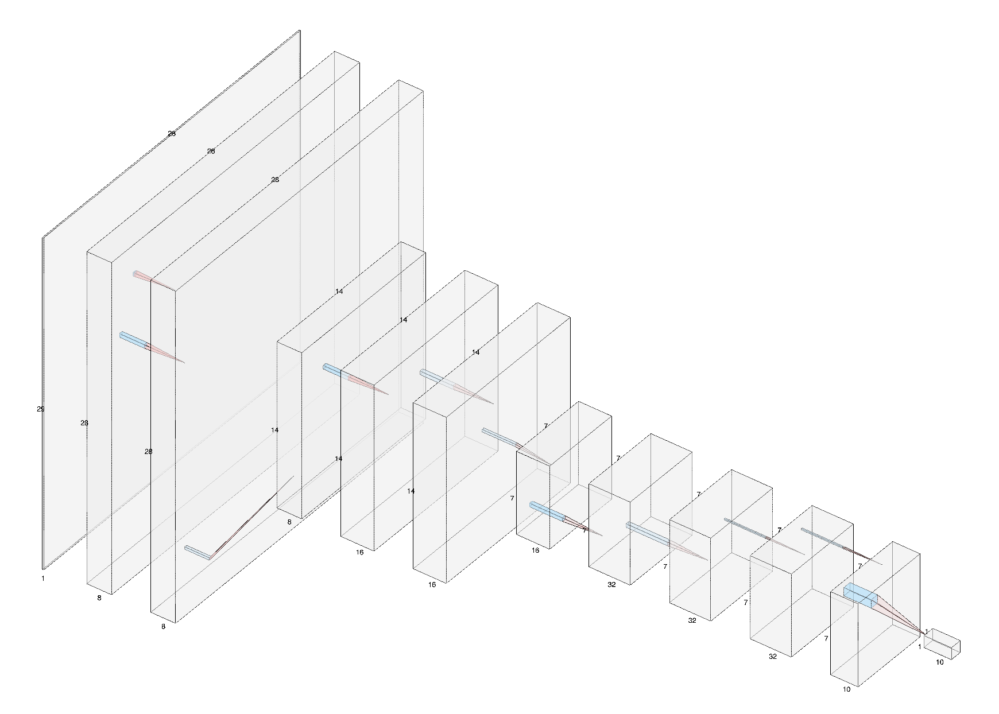

# Part 2

## Network



[Tool used for above diagram](https://alexlenail.me/NN-SVG/AlexNet.html)

```
============================================================================================================================================
Layer (type:depth-idx)                   Input Shape               Output Shape              Param #                   Param %
============================================================================================================================================
Net                                      [64, 1, 28, 28]           [64, 10]                  --                             --
├─Sequential: 1-1                        [64, 1, 28, 28]           [64, 8, 28, 28]           --                             --
│    └─Conv2d: 2-1                       [64, 1, 28, 28]           [64, 8, 28, 28]           72                          0.37%
│    └─Dropout: 2-2                      [64, 8, 28, 28]           [64, 8, 28, 28]           --                             --
│    └─ReLU: 2-3                         [64, 8, 28, 28]           [64, 8, 28, 28]           --                             --
│    └─BatchNorm2d: 2-4                  [64, 8, 28, 28]           [64, 8, 28, 28]           16                          0.08%
│    └─Conv2d: 2-5                       [64, 8, 28, 28]           [64, 8, 28, 28]           576                         2.94%
│    └─Dropout: 2-6                      [64, 8, 28, 28]           [64, 8, 28, 28]           --                             --
│    └─ReLU: 2-7                         [64, 8, 28, 28]           [64, 8, 28, 28]           --                             --
├─Sequential: 1-2                        [64, 8, 28, 28]           [64, 8, 14, 14]           --                             --
│    └─MaxPool2d: 2-8                    [64, 8, 28, 28]           [64, 8, 14, 14]           --                             --
├─Sequential: 1-3                        [64, 8, 14, 14]           [64, 16, 14, 14]          --                             --
│    └─BatchNorm2d: 2-9                  [64, 8, 14, 14]           [64, 8, 14, 14]           16                          0.08%
│    └─Conv2d: 2-10                      [64, 8, 14, 14]           [64, 16, 14, 14]          1,152                       5.89%
│    └─Dropout: 2-11                     [64, 16, 14, 14]          [64, 16, 14, 14]          --                             --
│    └─ReLU: 2-12                        [64, 16, 14, 14]          [64, 16, 14, 14]          --                             --
│    └─BatchNorm2d: 2-13                 [64, 16, 14, 14]          [64, 16, 14, 14]          32                          0.16%
│    └─Conv2d: 2-14                      [64, 16, 14, 14]          [64, 16, 14, 14]          2,304                      11.77%
│    └─Dropout: 2-15                     [64, 16, 14, 14]          [64, 16, 14, 14]          --                             --
│    └─ReLU: 2-16                        [64, 16, 14, 14]          [64, 16, 14, 14]          --                             --
├─Sequential: 1-4                        [64, 16, 14, 14]          [64, 16, 7, 7]            --                             --
│    └─MaxPool2d: 2-17                   [64, 16, 14, 14]          [64, 16, 7, 7]            --                             --
├─Sequential: 1-5                        [64, 16, 7, 7]            [64, 32, 7, 7]            --                             --
│    └─BatchNorm2d: 2-18                 [64, 16, 7, 7]            [64, 16, 7, 7]            32                          0.16%
│    └─Conv2d: 2-19                      [64, 16, 7, 7]            [64, 32, 7, 7]            4,608                      23.55%
│    └─Dropout: 2-20                     [64, 32, 7, 7]            [64, 32, 7, 7]            --                             --
│    └─ReLU: 2-21                        [64, 32, 7, 7]            [64, 32, 7, 7]            --                             --
│    └─BatchNorm2d: 2-22                 [64, 32, 7, 7]            [64, 32, 7, 7]            64                          0.33%
│    └─Conv2d: 2-23                      [64, 32, 7, 7]            [64, 32, 7, 7]            9,216                      47.09%
│    └─Dropout: 2-24                     [64, 32, 7, 7]            [64, 32, 7, 7]            --                             --
│    └─ReLU: 2-25                        [64, 32, 7, 7]            [64, 32, 7, 7]            --                             --
├─Sequential: 1-6                        [64, 32, 7, 7]            [64, 10]                  --                             --
│    └─BatchNorm2d: 2-26                 [64, 32, 7, 7]            [64, 32, 7, 7]            64                          0.33%
│    └─Conv2d: 2-27                      [64, 32, 7, 7]            [64, 32, 7, 7]            1,024                       5.23%
│    └─Dropout: 2-28                     [64, 32, 7, 7]            [64, 32, 7, 7]            --                             --
│    └─ReLU: 2-29                        [64, 32, 7, 7]            [64, 32, 7, 7]            --                             --
│    └─BatchNorm2d: 2-30                 [64, 32, 7, 7]            [64, 32, 7, 7]            64                          0.33%
│    └─Conv2d: 2-31                      [64, 32, 7, 7]            [64, 10, 7, 7]            330                         1.69%
│    └─ReLU: 2-32                        [64, 10, 7, 7]            [64, 10, 7, 7]            --                             --
│    └─AvgPool2d: 2-33                   [64, 10, 7, 7]            [64, 10, 1, 1]            --                             --
│    └─Flatten: 2-34                     [64, 10, 1, 1]            [64, 10]                  --                             --
│    └─LogSoftmax: 2-35                  [64, 10]                  [64, 10]                  --                             --
============================================================================================================================================
Total params: 19,570
Trainable params: 19,570
Non-trainable params: 0
Total mult-adds (M): 123.48
============================================================================================================================================
Input size (MB): 0.20
Forward/backward pass size (MB): 20.72
Params size (MB): 0.08
Estimated Total Size (MB): 21.00
============================================================================================================================================
```

## Code structure
```
# Convolution Block 1
	self.cblock1 = nn.Sequential(
	    	      conv -> drop -> relu ->
	    	bn -> conv -> drop -> relu
        )
        
        # Transition Block 1
        self.tblock1 = nn.Sequential(
        	maxpool
        )
        
        # Convolution Block 2
        self.cblock2 = nn.Sequential(
	    	bn -> conv -> drop -> relu ->
	    	bn -> conv -> drop -> relu
        )
        
        # Transition Block 2
        self.tblock2 = nn.Sequential(
	        maxpool
        )
        
        # Convolution Block 3
        self.cblock3 = nn.Sequential(
	    	bn -> conv -> drop -> relu ->
	    	bn -> conv -> drop -> relu
        )
        
        # Output Block
        self.outblock = nn.Sequential(
	    	bn -> conv -> drop -> relu ->
	    	bn -> conv -> relu -> avgpool ->
	        flatten -> logsoftmax
        )
```

## Features
- Network is divided into 3 Convolution blocks and 1 output block.
- Number of channels steadily increased to **32**. Batch size fixed to **64**.
- MaxPool used after first 2 convolution blocks only.
- Max receptive field reached is **32**.
- Batch normalisation and dropouts (5%) are used in all convolution layers except near output.
- The output layer uses **1x1 convolution before GAP layer**.
- No FC layer is used anywhere.
- The network hit above **99.44%** validation accuracy in **8th** epoch!! Max accuracy is **99.48%**.
- Total number of parameters is 19570.
